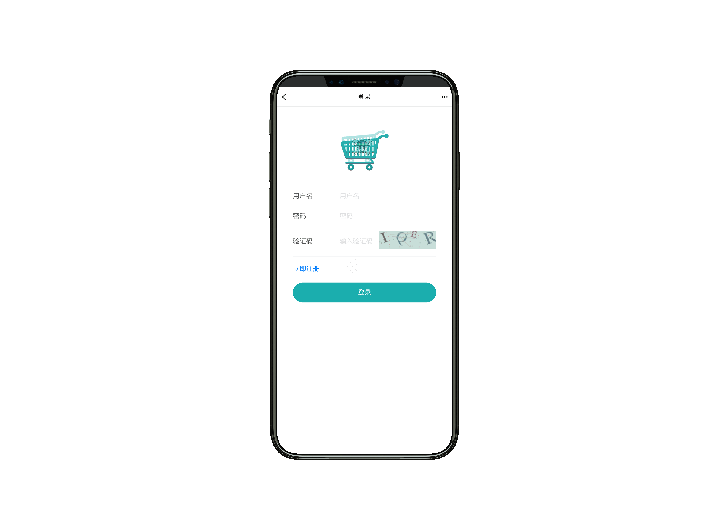
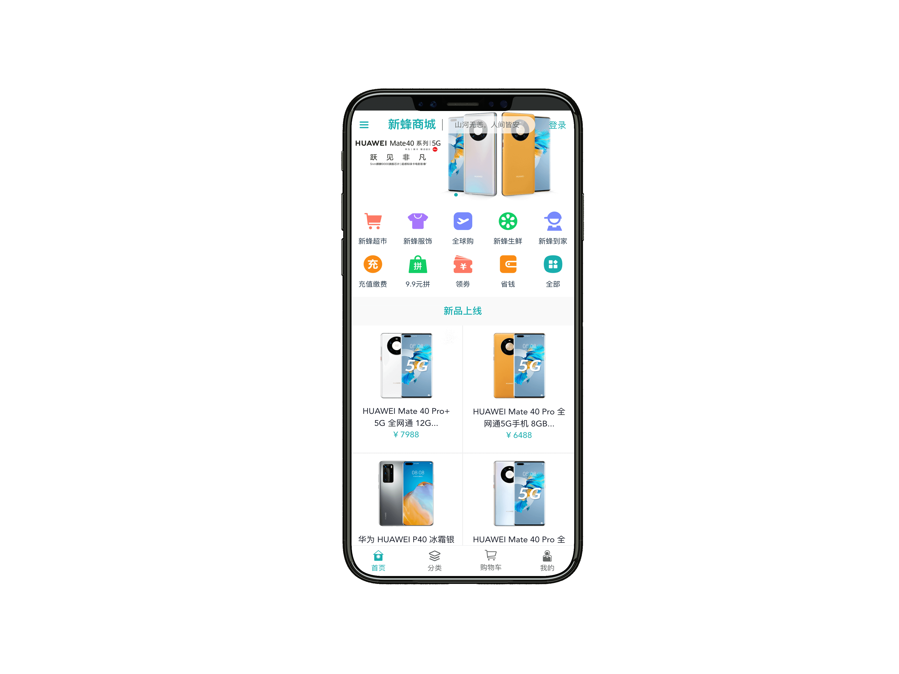
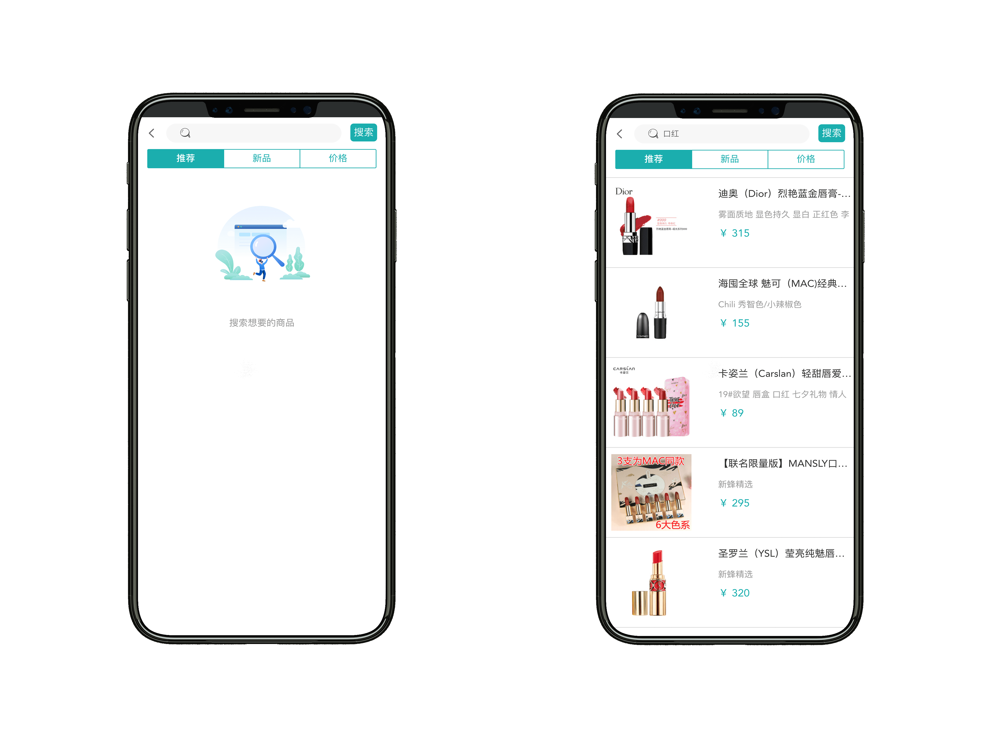
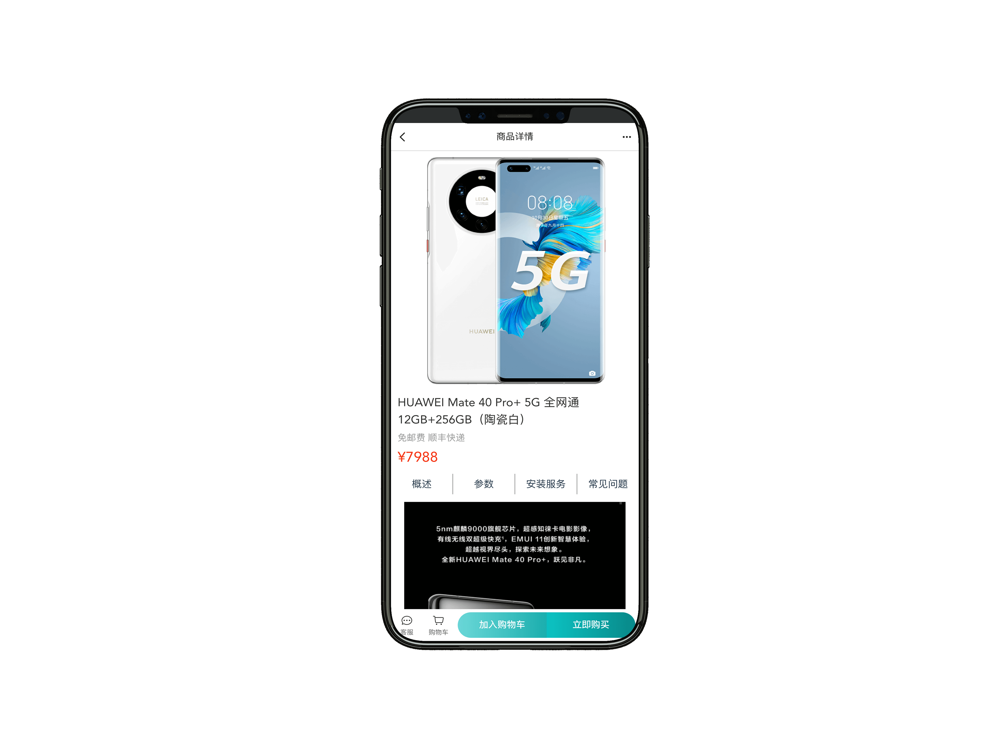
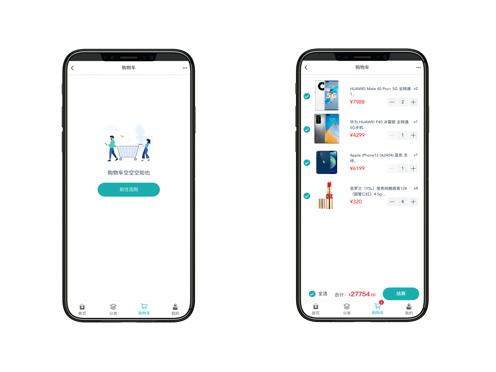
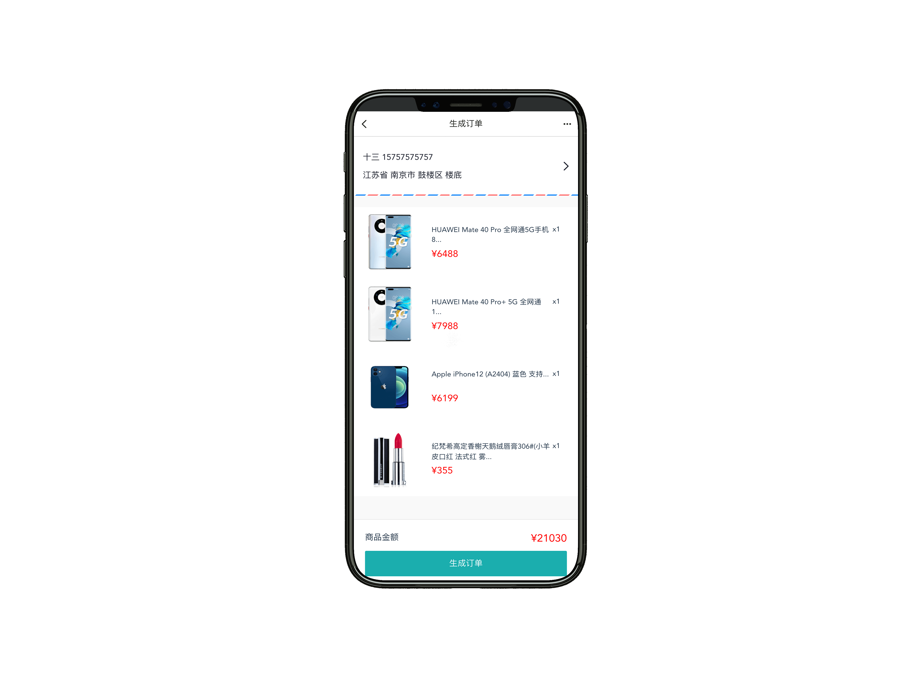
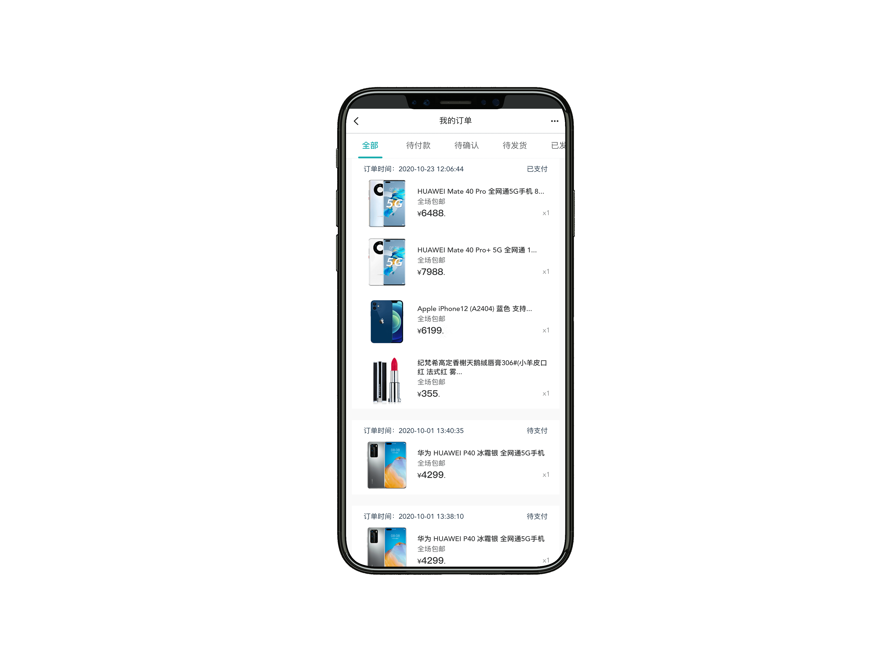
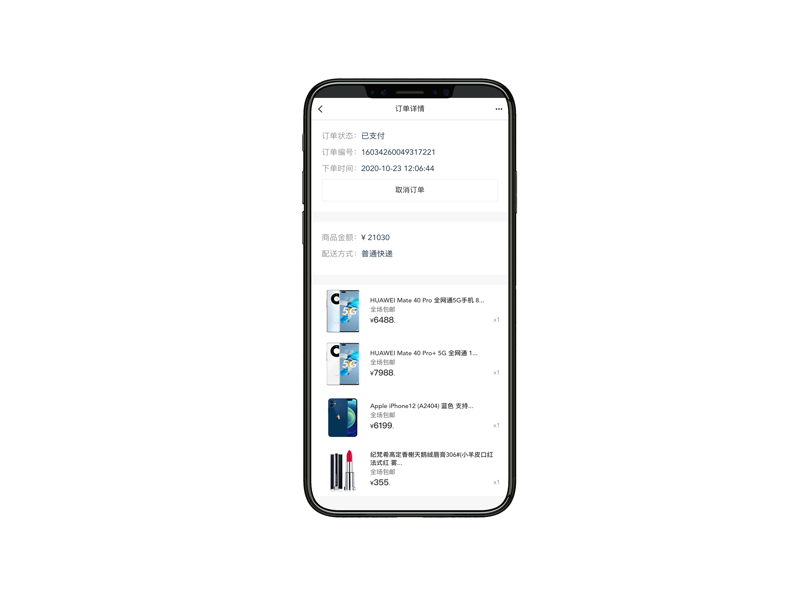

- [知乎：如何看待慕课网涉嫌抄袭开源项目作为《Java工程师》的终极项目并上线销售？](https://www.zhihu.com/question/464292538)
- [《newbee-mall开源项目被慕课网拿去做课程，然后我毫不知情，这又是什么骚操作？》](https://mp.weixin.qq.com/s/xEk-y9HA8RxJWMplpTQ1MQ)
- [《起诉书！慕课网你敢抄袭，我就敢起诉你！》](https://mp.weixin.qq.com/s/oXr6O7u7vqQQi8mzTkoTDg)
- [《花费3680元买了一个慕课网的Java就业班课程，里面竟然有自己写的开源项目！》](https://mp.weixin.qq.com/s/TLZbAEjRi0YT1t8xoFv4dQ)
- [《newbee-mall开源项目被慕课网拿去做课程，讲师已道歉，课程却还在售卖》](https://mp.weixin.qq.com/s/sue5JyZcysFRNFTxUnZiIQ)
- [《可笑！慕课网涉嫌抄袭开源项目至今没有道歉，而且在偷偷的“毁尸灭迹”》](https://mp.weixin.qq.com/s/UTsA5WOFPH4UUf5rEj2HpQ)
- [《最新证据：代码相似度达到90%以上！再谈慕课网涉嫌抄袭事件》](https://mp.weixin.qq.com/s/myejz9icB55wfdHEFNvrBw)
- [《newbee-mall开源项目被慕课网拿去做课程，项目详细对比记录，更多实锤看这里》](https://mp.weixin.qq.com/s/JTt0r_t8qhfUwkhpdUjrTg)
- [《一个被慕课网拿去做Java就业班终极项目的开源商城项目，推荐给大家》](https://mp.weixin.qq.com/s/BKIETwgEPBprWYhQZJDLIA)

newbee-mall 项目是一套电商系统，包括 newbee-mall 商城系统及 newbee-mall-admin 商城后台管理系统，基于 Spring Boot 2.X 和 Vue 以及相关技术栈开发。 前台商城系统包含首页门户、商品分类、新品上线、首页轮播、商品推荐、商品搜索、商品展示、购物车、订单结算、订单流程、个人订单管理、会员中心、帮助中心等模块。 后台管理系统包含数据面板、轮播图管理、商品管理、订单管理、会员管理、分类管理、设置等模块。

本仓库中的源码为新蜂商城前后端分离版本的 Vue 项目（Vue 版本为 3.x），主要面向前端开发人员，后端 API 源码在另外一个仓库 [newbee-mall-api](https://github.com/newbee-ltd/newbee-mall-api)。

新蜂商城 Vue3 版本线上预览地址：[http://vue3-app.newbee.ltd](http://47.99.134.126:5008)，账号可自行注册，建议使用手机模式打开。

## newbee-mall （新蜂商城）系列项目概览

| 项目名称             | 仓库地址                                                     | 备注                                                         |
| :------------------- | ------------------------------------------------------------ | ------------------------------------------------------------ |
| newbee-mall          | [newbee-mall in GitHub](https://github.com/newbee-ltd/newbee-mall) [newbee-mall in Gitee](https://gitee.com/newbee-ltd/newbee-mall) | 初始版本、Spring Boot、Thymeleaf、MyBatis、MySQL             |
| newbee-mall-plus     | [newbee-mall-plus in GitHub](https://github.com/newbee-ltd/newbee-mall-plus) [newbee-mall-plus in Gitee](https://gitee.com/newbee-ltd/newbee-mall-plus) | 升级版本、优惠券、秒杀、支付、Spring Boot、Thymeleaf、MyBatis、MySQL、Redis |
| newbee-mall-cloud    | [newbee-mall-cloud in GitHub](https://github.com/newbee-ltd/newbee-mall-cloud) [newbee-mall-cloud in Gitee](https://gitee.com/newbee-ltd/newbee-mall-cloud) | 微服务版本、分布式事务、Spring Cloud Alibaba、Nacos、Sentinel、OpenFeign、Seata |
| newbee-mall-api      | [newbee-mall-api in GitHub](https://github.com/newbee-ltd/newbee-mall-api) [newbee-mall-api in Gitee](https://gitee.com/newbee-ltd/newbee-mall-api) | 前后端分离、Spring Boot、MyBatis、Swagger、MySQL             |
| newbee-mall-api-go   | [newbee-mall-api-go in GitHub](https://github.com/newbee-ltd/newbee-mall-api-go) [newbee-mall-api-go in Gitee](https://gitee.com/newbee-ltd/newbee-mall-api-go) | 前后端分离、Go、Gin、MySQL                                   |
| newbee-mall-vue-app  | [newbee-mall-vue-app in GitHub](https://github.com/newbee-ltd/newbee-mall-vue-app) [newbee-mall-vue-app in Gitee](https://gitee.com/newbee-ltd/newbee-mall-vue-app) | 前后端分离、Vue 2.x、Vant                                    |
| newbee-mall-vue3-app | [newbee-mall-vue3-app in GitHub](https://github.com/newbee-ltd/newbee-mall-vue3-app) [newbee-mall-vue3-app in GitHub](https://gitee.com/newbee-ltd/newbee-mall-vue3-app) | 前后端分离、Vue 3.0、Vue-Router 4.0、Vuex 4.0、Vant 3.0      |
| vue3-admin           | [vue3-admin in GitHub](https://github.com/newbee-ltd/vue3-admin) [vue3-admin in Gitee](https://gitee.com/newbee-ltd/vue3-admin) | 前后端分离、Vue 3.0、Element-Plus、Vue-Router 4.0、Vite      |

**坚持不易，如果觉得项目还不错的话可以给项目一个 Star 吧，也是对我一直更新代码的一种鼓励啦，谢谢各位的支持。**

## 开发及部署文档

- [向“全栈”进发！大型线上商城实战项目，Spring Boot + Vue 前后端分离版本的商城来了！](https://juejin.im/book/6844733826191589390)
- [项目须知和课程约定](https://juejin.im/book/6844733826191589390)
- [全栈开发！你必须要知道的“前后端分离”](https://juejin.im/book/6844733826191589390)
- [前端模块化的发展历史](https://juejin.im/book/6844733826191589390)
- [传统页面和单页面的权衡与抉择](https://juejin.im/book/6844733826191589390)
- [准备工作及基础环境搭建（后端）](https://juejin.im/book/6844733826191589390)
- [Spring Boot 项目初体验--项目搭建及启动](https://juejin.im/book/6844733826191589390)
- [项目编码简化利器！Spring Boot 整合 Lombok](https://juejin.im/book/6844733826191589390)
- [Lombok 插件问题处理](https://juejin.im/book/6844733826191589390)
- [商城后端项目启动和运行注意事项](https://juejin.im/book/6844733826191589390)
- [VSCode 的相关配置及插件介绍](https://juejin.im/book/6844733826191589390)
- [基础篇：Vue 指令](https://juejin.im/book/6844733826191589390)
- [基础篇：Vue全局API及生命周期介绍](https://juejin.im/book/6844733826191589390)
- [基础篇: CSS 预处理工具Less的介绍及使用](https://juejin.im/book/6844733826191589390)
- [Vue 脚手架工具 Vue-Cli 配置介绍](https://juejin.im/book/6844733826191589390)
- [Vue-Router 浅析原理及使用](https://juejin.im/book/6844733826191589390)
- [全局状态管理插件 Vuex 介绍及使用](https://juejin.im/book/6844733826191589390)
- [商城前端 H5 开发环境搭建及项目启动](https://juejin.im/book/6844733826191589390)
- [前后端交互文档利器！Spring Boot 整合 Swagger](https://juejin.im/book/6844733826191589390)
- [接口参数处理和统一响应结果](https://juejin.im/book/6844733826191589390)
- [口设计规范及接口调用实践](https://juejin.im/book/6844733826191589390)
- [商城开发实战-用户登录接口开发](https://juejin.im/book/6844733826191589390)
- [商城开发实战-用户身份认证详解](https://juejin.im/book/6844733826191589390)
- [商城开发实战-首页模块接口开发](https://juejin.im/book/6844733826191589390)
- [商城开发实战-分类模块接口开发](https://juejin.im/book/6844733826191589390)
- [商城开发实战-商品搜索模块接口开发](https://juejin.im/book/6844733826191589390)
- [商城开发实战-购物车模块接口开发](https://juejin.im/book/6844733826191589390)
- [商城开发实战-个人信息及收货地址接口开发](https://juejin.im/book/6844733826191589390)
- [商城开发实战-下单流程接口开发](https://juejin.im/book/6844733826191589390)
- [商城开发实战-订单处理流程详解](https://juejin.im/book/6844733826191589390)
- [商城移动端开发实战-新蜂商城底部导航(抽离公共组件)](https://juejin.im/book/6844733826191589390)
- [商城移动端开发实战-新蜂商城登录注册页(前端鉴权)](https://juejin.im/book/6844733826191589390)
- [商城移动端开发实战-商城首页制作(轮播图、首页商品列表)](https://juejin.im/book/6844733826191589390)
- [商城移动端开发实战-商品分类页面制作(better-scrol的介绍及使用)](https://juejin.im/book/6844733826191589390)
- [商城移动端开发实战-商品列表页面制作(无限滚动加载)](https://juejin.im/book/6844733826191589390)
- [商城移动端开发实战-商品详情页面制作(Vuex 购物车数量全局管理)](https://juejin.im/book/6844733826191589390)
- [商城移动端开发实战-商城购物车页面制作(购物车页)](https://juejin.im/book/6844733826191589390)
- [商城移动端开发实战-确认订单页面制作](https://juejin.im/book/6844733826191589390)
- [商城移动端开发实战-地址栏管理页面制作](https://juejin.im/book/6844733826191589390)
- [商城移动端开发实战-我的订单页面制作](https://juejin.im/book/6844733826191589390)
- [Vue 3.x 新特性概览](https://juejin.im/book/6844733826191589390)
- [新蜂商城迁移至 Vue 3.x 流程讲解](https://juejin.im/book/6844733826191589390)

## 联系作者

> 大家有任何问题或者建议都可以在 [issues](https://github.com/newbee-ltd/newbee-mall-vue3-app/issues) 中反馈给我，我会慢慢完善这个项目。

- 我的邮箱：2449207463@qq.com
- QQ技术交流群：932227898 552142710

关注公众号：**程序员十三**，回复"勾搭"进群交流。

## 软件著作权

>本系统已申请软件著作权，受国家版权局知识产权以及国家计算机软件著作权保护！

## 页面展示

以下为新蜂商城 Vue3 版本的页面预览：

- 登录页

- 首页

- 商品搜索

- 商品详情页

- 购物车

- 生成订单

- 地址管理

- 订单列表

- 订单详情

## 感谢

- [Vue](https://github.com/vuejs/vue)
- [Vue-Router](https://github.com/vuejs/vue-router-next)
- [Vuex](https://github.com/vuejs/vuex/tree/4.0)
- [Vant](https://github.com/youzan/vant)
- [better-scroll](https://github.com/ustbhuangyi/better-scroll)
